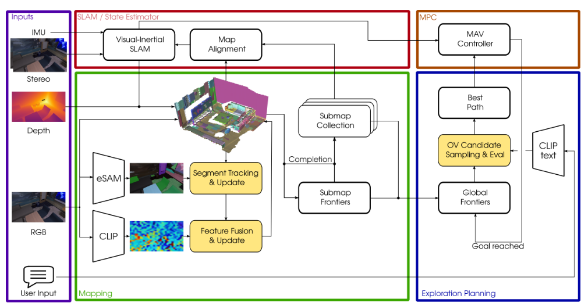
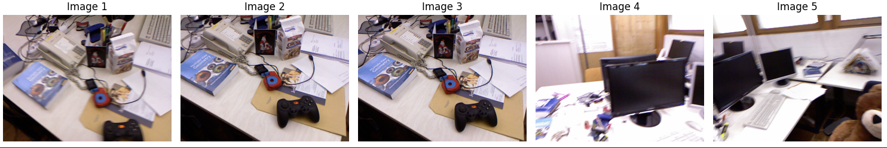

# VLMsFor3D

My experiments with foundation models, VLMs and 3D vision. I'll start by attempting to implement parts of the [FindAnything paper](https://arxiv.org/abs/2504.08603v2), where VLM-derived features allow to query a 3D model/representation for semantic/object information.

## FindAnything
The system proposed in FindAnything comprises several modules: SLAM/state-estimation, mapping, segmentation+VLM feature estimation, tracking, merging/fusion, and robot control/planning. 

I'll first attempt the "mapping" submodule as shown in the green box below:


### Data
I'll assume we have some imagery with depth maps and RGB images. I will also assume we have pose and camera information for projection/mapping of image data into 3D space. For the sake of experimentation, I'll use the TUM RGB-D dataset, see [here](https://cvg.cit.tum.de/data/datasets/rgbd-dataset/download). In particular, the notebook `mapping.ipynb` uses `rgbd_dataset_freiburg1_desk2`:


### Dev environment
The software needed for running eSAM, CLIP, Open3D and some other basic things in `requirements.txt`, so create your virtual environment (conda, venv, etc) and:
```
# install curl and wget if needed, they are used to get model checkpoints

# create dev environment
conda create -n FindAnything python==3.10.18
conda activate FindAnything

# prep the environment via the Makefile
# cd into the root of the repo and 
make
```
The code above will: 1) install dev packages from requirements.txt, 2) Install CLIP and eTAM, and 3) Download the eTAM checkpoints

Note: I'm running ubuntu 24.04 with an NVIDIA 3080 and `560.35.05` driver, i.e., cuda 12 compatible.


### Code
For now, check out the notebooks but first pull the submodules
```
git submodule init
git submodule update
```