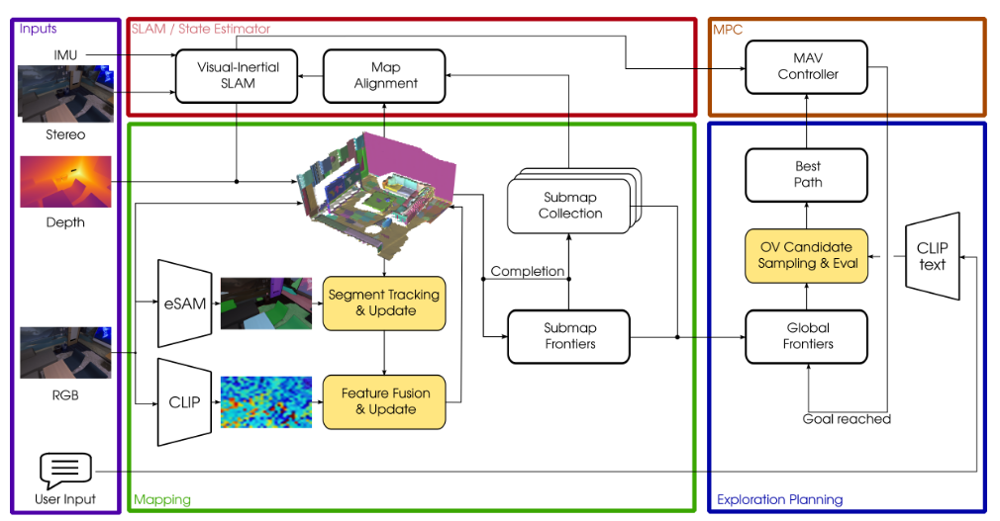
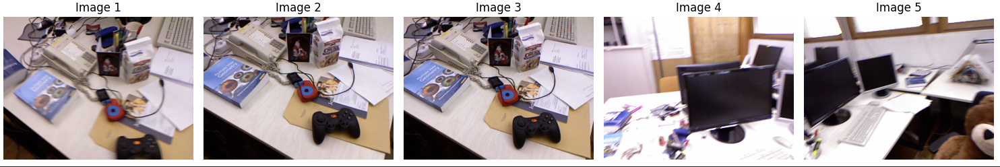

# VLMsFor3D

My experiments with foundation models, VLMs and 3D vision. I'll start by attempting to implement parts of the [FindAnything paper](https://arxiv.org/abs/2504.08603v2), where VLM-derived features allow to query a 3D model/representation for semantic/object information.

## FindAnything
The system proposed in FindAnything comprises several modules: SLAM/state-estimation, mapping, segmentation+VLM feature estimation, tracking, merging/fusion, and robot control/planning. 

I'll first attempt the "mapping" submodule as shown in the green box below:


### Data
I'll assume we have some imagery with depth maps and RGB images. I will also assume we have pose and camera information for projection/mapping of image data into 3D space. For the sake of experimentation, I'll use the TUM RGB-D dataset, see [here](https://cvg.cit.tum.de/data/datasets/rgbd-dataset/download). In particular, the notebook `mapping.ipynb` uses `rgbd_dataset_freiburg1_desk2`:


### Dev environment
The software needed for running eSAM, CLIP, Open3D and some other basic things in `requirements.txt`, so create your virtual environment (conda, venv, etc) and:
```
# install curl and wget if needed, they are used to get model checkpoints

# create dev environment
conda create -n FindAnything python==3.10.18
conda activate FindAnything

# prep the environment via the Makefile
# cd into the root of the repo and 
make
```
The code above will: 1) install dev packages from requirements.txt, 2) Install CLIP and eTAM, and 3) Download the eTAM checkpoints

Note: I'm running ubuntu 24.04 with an NVIDIA 3080 and `560.35.05` driver, i.e., cuda 12 compatible.


### Code
First pull the submodules:
```
git submodule init
git submodule update
```

#### Notebooks
The `notebooks/mapping.ipynb` notebook walks through the full pipeline interactively — model setup, segmentation, CLIP feature extraction, 3D projection, voxel fusion, and text-based querying.

#### CLI script
`scripts/mapping.py` packages the notebook pipeline into a single command. It adds blur-based frame filtering with a configurable time-window policy: within each window, only sharp frames are processed; if no sharp frame appears before the window expires, the best available frame is used as a fallback.

```bash
conda activate FindAnything

# Basic run — process all frames from a TUM RGB-D sequence
python scripts/mapping.py -d /path/to/rgbd_dataset_freiburg1_desk2

# With text query and debug outputs (mask overlays, per-frame similarity maps, blur logs)
python scripts/mapping.py \
  -d /path/to/rgbd_dataset_freiburg1_desk2 \
  --query "a white keyboard" \
  --debug \
  -o ./output

# Tune blur filtering and voxel resolution
python scripts/mapping.py \
  -d /path/to/rgbd_dataset_freiburg1_desk2 \
  --blur-threshold 150 \
  --time-window 1.5 \
  --voxel-resolution 0.02 \
  --max-views 50
```

| Argument | Default | Description |
|---|---|---|
| `-d, --data-path` | *(required)* | Path to TUM RGB-D dataset directory |
| `-b, --blur-threshold` | `100.0` | Min Laplacian-variance score to accept a frame |
| `-t, --time-window` | `2.0` | Time window (seconds) before fallback to best frame |
| `-v, --voxel-resolution` | `0.03` | Voxel edge length in metres for feature fusion |
| `-m, --max-views` | `0` (all) | Max frames to process |
| `-q, --query` | `None` | Text query for similarity visualisation |
| `-o, --output-dir` | `./output` | Output directory |
| `--debug` | off | Save mask overlays, similarity maps, blur logs, timing stats |
| `--interactive` | off | Open an Open3D viewer window (requires display) |

**Outputs:**
- `cloud.ply` — fused RGB point cloud
- `voxels.ply` — activated voxel centres coloured by observation count
- `query.ply` + `query_screenshot.png` — similarity-coloured cloud (when `--query` is set)
- `masks/` — per-frame mask overlays on RGB (when `--debug`)
- `similarity/` — per-frame RGB + similarity heatmap side-by-side (when `--debug` + `--query`)

### TODOs
- [ ] Load camera intrinsics from file instead of hardcoding for `freiburg1_desk2`
- [ ] Replace GT poses with a VI-SLAM frontend (e.g. [supereight2](https://github.com/ethz-mrl/supereight2) as in FindAnything)
- [ ] Use a proper volumetric map (TSDF / supereight2) instead of the uniform voxel grid for fusion
- [ ] Implement segment tracking and merging across frames (currently each frame is independent)
- [ ] Explore alternatives to CLIP dense features — SigLIP2 patch features lack text alignment without a decoder, but a lightweight projection head could help
- [ ] Tune eSAM thresholds (`pred_iou_thresh`, `stability_score_thresh`) for denser segmentation coverage
- [ ] Add support for other RGB-D datasets beyond TUM format